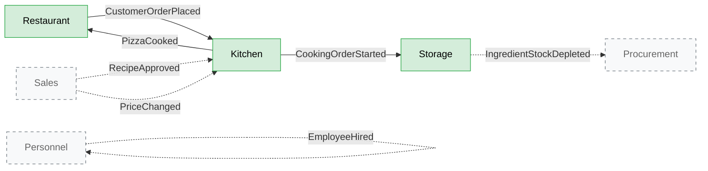

# Context Map

This document describes the bounded contexts of the Pizza House system, the relationships between them, and the flow of domain events that integrates them. It is the strategic counterpart to the tactical models in `docs/domain-models/`.

## Bounded Contexts

The system is partitioned into six bounded contexts. Three are fully implemented in code; three exist only as models on this page.

| Context        | Implementation | Responsibility                                                                  |
| -------------- | -------------- | ------------------------------------------------------------------------------- |
| **Kitchen**    | Full           | Recipes, cooking orders, pizza preparation                                      |
| **Storage**    | Full           | Ingredient stock, consumption, low-stock signals                                |
| **Restaurant** | Full           | Customer orders, order lifecycle from placement to delivery                     |
| Personnel      | Documented     | Employees, salaries, bonuses, events                                            |
| Procurement    | Documented     | Purchase orders to suppliers, supplier management                               |
| Sales          | Documented     | Pricing policy, recipe approval workflow                                        |

The three implemented contexts cover the critical business flow: a customer places an order, the kitchen cooks it using ingredients from storage, and the order is delivered. Everything else is supporting capability and is deliberately out of MVP scope.

## Relationships



Solid arrows are integrations implemented in code. Dashed arrows are integrations that exist in the model but are not implemented — the events are published by the implemented contexts (where applicable), but no handler consumes them. They are visible in the messenger log to demonstrate the integration surface.

### Relationship types

All inter-context integration follows the same pattern: **Published Language via domain events on the async event bus**. There are no direct method calls between contexts, no shared database tables, and no shared aggregates.

For each integration:

- **Restaurant → Kitchen** (Customer-Supplier): Restaurant is upstream and defines what a placed order looks like. Kitchen conforms to that contract by listening to `CustomerOrderPlaced`. Each event carries enough data for Kitchen to act without calling back.
- **Kitchen → Storage** (Customer-Supplier): Kitchen is upstream — when a cooking order starts, it announces which ingredients are needed. Storage decides how to react (decrement, reject, signal low stock).
- **Kitchen → Restaurant** (Customer-Supplier reverse): Kitchen announces `PizzaCooked`. Restaurant updates its order state accordingly.
- **Storage → Procurement** (would-be Customer-Supplier): Storage announces `IngredientStockDepleted`; Procurement would listen if implemented.
- **Sales → Kitchen** (would-be Customer-Supplier): Sales announces pricing and recipe approval decisions; Kitchen would adjust accordingly.

## Main Event Flow

The happy path of the system, end to end:

```mermaid
sequenceDiagram
    actor Customer
    participant Restaurant
    participant Kitchen
    participant Storage
    actor FrontDesk

    Customer->>Restaurant: PlaceCustomerOrder (command)
    Restaurant-->>Restaurant: create CustomerOrder<br/>(status: placed)
    Restaurant->>Kitchen: CustomerOrderPlaced (event)

    Kitchen-->>Kitchen: create CookingOrder<br/>per pizza item
    Kitchen->>Storage: CookingOrderStarted (event)<br/>{ingredients: [...]}

    Storage-->>Storage: decrement Stock<br/>for each ingredient
    alt stock below threshold
        Storage->>Storage: publish IngredientStockDepleted<br/>(no consumer; logged)
    end

    Kitchen-->>Kitchen: complete cooking
    Kitchen->>Restaurant: PizzaCooked (event)

    Restaurant-->>Restaurant: mark item ready<br/>if all ready → mark order ready
    Restaurant->>Restaurant: CustomerOrderReady (event)

    FrontDesk->>Restaurant: DeliverOrder (command)
    Restaurant->>Restaurant: CustomerOrderDelivered (event)
```

### Step-by-step

1. **Customer places an order.** The Restaurant context receives a `PlaceCustomerOrder` command via HTTP. It creates a `CustomerOrder` aggregate containing one or more items (each referencing a recipe by id with a quantity). The aggregate validates the order, persists it, and records a `CustomerOrderPlaced` domain event.

2. **Kitchen receives the order.** The `CustomerOrderPlaced` event is consumed asynchronously by a handler in the Kitchen context. For each item in the order, the handler creates a `CookingOrder` aggregate. Each cooking order references back to the customer order id so we can correlate later.

3. **Storage is informed about ingredient consumption.** When a `CookingOrder` transitions to in-progress, it records a `CookingOrderStarted` event that carries the list of required ingredients (name + quantity) directly in its payload. Storage consumes this event and decrements each `Stock` aggregate accordingly.

4. **Low stock is signaled.** If a `Stock` aggregate's available quantity falls below its threshold for the first time, it records `IngredientStockDepleted`. The event is published but has no consumer in the MVP — it exists to demonstrate the integration surface with the (documented-only) Procurement context.

5. **Pizza is cooked.** When the Kitchen completes preparation, the `CookingOrder` transitions to ready and records `PizzaCooked`. This is consumed by a Restaurant handler that marks the corresponding order item as ready. When all items of an order are ready, the `CustomerOrder` transitions to ready-for-delivery and records `CustomerOrderReady`.

6. **Order is delivered.** Front-desk staff issues a `DeliverOrder` command. The `CustomerOrder` transitions to delivered and records `CustomerOrderDelivered`.

## Eventual Consistency and Trade-offs

The flow above is **eventually consistent** between Kitchen, Storage, and Restaurant. This is a deliberate choice with specific implications:

- **Stock can go negative.** If Kitchen starts cooking and Storage hasn't yet processed the consumption event, the `Stock` aggregate may receive a `ConsumeIngredient` command for more than it has. In the MVP, the `Stock` aggregate enforces the invariant `availableQuantity >= 0` strictly — if the consumption would violate it, it records `IngredientOutOfStock` instead of decrementing. Kitchen does not currently react to this. In a production system, this would trigger a compensating action (cancel the cooking order, notify the customer). This is documented as a known gap.

- **Order state lags.** When a customer queries their order status, the answer reflects the state at the last consumed event. If Kitchen has just finished cooking but the `PizzaCooked` event hasn't been processed yet by the Restaurant handler, the order will still show as "preparing." This is acceptable for a pizza shop — the lag is measured in seconds.

- **No distributed transactions.** No two-phase commits, no sagas in the MVP. The bus is reliable (Doctrine transport persists messages in the same database), so events are never lost — but they may arrive out of order if multiple workers are running. The MVP runs a single worker, which serializes consumption per transport.

## Cross-Context Rules

These rules are enforced by the `code-reviewer` agent:

1. **No imports across contexts.** `src/Kitchen/` MUST NOT import from `src/Storage/` or `src/Restaurant/`. The only shared imports allowed are from `src/Shared/`.

2. **All integration goes through events.** If a Kitchen handler needs data that lives in Storage, it MUST receive that data in an event payload — not by calling a Storage repository or service.

3. **Event payloads are self-sufficient.** Each event carries enough information for handlers to act without callbacks. If `CookingOrderStarted` requires ingredient data, that data is embedded in the event, even though it originated from a `Recipe` aggregate.

4. **Events are versioned implicitly.** For the MVP, we don't version events explicitly. If a payload shape needs to change, we add a new event class rather than mutating the old one. This is documented as a trade-off in `docs/architecture.md`.

## Implemented vs. Documented Contexts

For tactical details (aggregates, value objects, events, commands, queries) of the three implemented contexts, see:

- [`docs/domain-models/kitchen.md`](./domain-models/kitchen.md)
- [`docs/domain-models/storage.md`](./domain-models/storage.md)
- [`docs/domain-models/restaurant.md`](./domain-models/restaurant.md)

The three documented-only contexts are described in summary below. They are not implemented and have no code in `src/`.

### Personnel (documented only)

**Purpose.** Manage employees, their compensation, and company events.

**Likely aggregates.** `Employee` (root), `SalaryAgreement`, `BonusPayout`, `CompanyEvent`.

**Integration surface.**
- Would listen to: `CustomerOrderDelivered` to potentially trigger performance bonuses.
- Would publish: `EmployeeHired`, `SalaryAdjusted`, `BonusAwarded`.

**Why not implemented.** This context has no critical interaction with the main order-fulfillment flow. Its events are interesting but not on the demonstrated path.

### Procurement (documented only)

**Purpose.** Order ingredients from suppliers when stock runs low; manage supplier relationships.

**Likely aggregates.** `PurchaseOrder` (root, with line items), `Supplier`.

**Integration surface.**
- Would listen to: `IngredientStockDepleted` (already published by Storage) to trigger an automatic purchase order draft.
- Would publish: `PurchaseOrderPlaced`, `SupplierApproved`, `DeliveryReceived` (which Storage would then listen to in order to increment stock).

**Why not implemented.** The event `IngredientStockDepleted` is already published by the implemented Storage context, demonstrating the integration boundary. Implementing the procurement side would be straightforward but not architecturally distinctive.

### Sales (documented only)

**Purpose.** Set pricing for pizzas, approve new recipes proposed by the kitchen, accept or reject suppliers proposed by procurement.

**Likely aggregates.** `PricingPolicy`, `RecipeApprovalRequest`, `SupplierApprovalRequest`.

**Integration surface.**
- Would listen to: `RecipeCreated` (from Kitchen) to start an approval workflow.
- Would publish: `RecipeApproved`, `RecipeRejected`, `PriceChanged`. Kitchen would consume these to activate recipes and update prices.

**Why not implemented.** Approval workflows are well-understood plumbing; they don't showcase architectural depth beyond what Kitchen/Storage/Restaurant already demonstrate.

## What This Document Is For

This context map is the strategic input to the `domain-modeler` sub-agent. When asked to design or implement a context, the agent reads this file plus the relevant tactical file under `docs/domain-models/`, then proposes an aggregate model for confirmation before writing code.

Changes to this map are architectural decisions — they should be discussed with the human reviewer, not made by the agent unilaterally.
